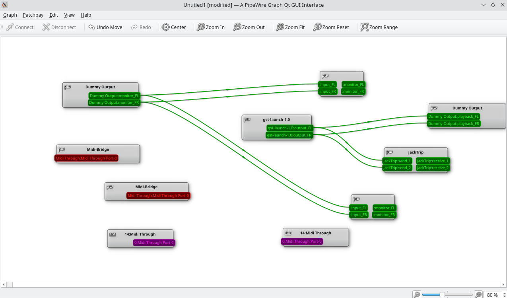

# Ripxovoice

## Description

This readme is a WIP.

## Getting Started

### Dependencies

List any dependencies that need to be installed for this software to work. For example:

- Dependency 1
- Dependency 2

### Setup

(2024/01/07) This way of connecting everything is now deprecated. I am now using physical USB audio interfaces that gets passthrough to each virtual machine. This way I have a lot simpler streaming setup as I only need to stream from my workstation to a node which feeds line level audio to each audio interface.The next step is to create a desktop application which manages the actual part that runs on the workstation, unifying both the audio streaming and managing how keystrokes gets sent. Some current ideas I have includes:

- Being able to switch between English and Swedish using a button in a GUI.
    - Done by the workstation figuring out if Windows is in English or Swedish mode currently using a screenshot or something similar.

Currently (2023/12/17) setup everything accordingly:
(Note: There is no longer any need for running the audio from the VM host, voiceboxlinux also manages the routing to Windows using 192.168.122.xxx)

- In voiceboxlinux start Jacktrip: `PIPEWIRE_LATENCY="1024/48000" jacktrip -s`
- In Windows:
    - Start qjackctl (Pinned on the taskbar)
- In Windows:
    - Start Jacktrip (from terminal): `.\jacktrip.exe -c 192.168.122.137`
- In voiceboxlinux start the server: `./linux_gstreamer_server/serve_dest.sh`
- Route audio from client (can be any client)
- In voiceboxlinux Manually route the audio according to this screenshot: 

### Using

Instructions for how to use your project. For example:

- Step 1
- Step 2

## Contributing

Details about how other developers can contribute to your project.

## License

Information about the license your project uses.